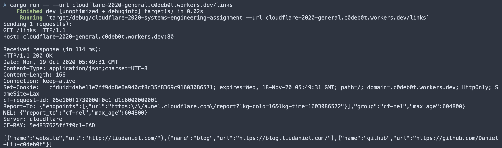
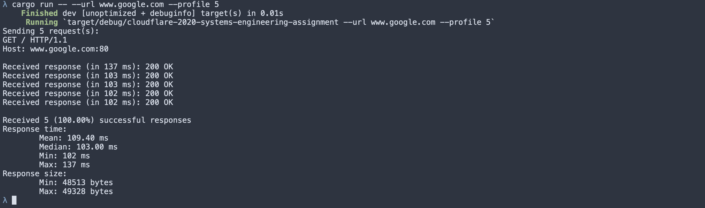

# Systems Assignment

This is Daniel Liu's solution for the Systems Assignment for applying to the 2021 Cloudflare internship. The General Assignment solution can be found [here](https://github.com/Daniel-Liu-c0deb0t/cloudflare-2020-general-engineering-assignment). All required and extra-credit assignments are satisfied. This Rust program is able to send HTTP GET requests, dump the response, and profile the response speed. Additionally, this is able to stitch together chunked HTTP responses, so it can be used to retrieve a large web page.

## Usage
To build and run the code, use
```
cargo run -- --url https://cloudflare-2020-general.c0deb0t.workers.dev/links
```
or
```
cargo run -- --url https://cloudflare-2020-general.c0deb0t.workers.dev/links --profile 5
```
Use `--help` to see the help message. Note that it might be a good idea to set a high `--delay` (default: 100 ms), so the
server is not overloaded with GET requests when the profile count is high.

To run the unit tests, use
```
cargo test
```

## Screenshots
Here are two screenshots of using this program. Note that responses are not printed when profiling, to reduce clutter.





## Comparison
[www.example.com](http://www.example.com)
```
Sending 5 request(s):
GET / HTTP/1.1
Host: www.example.com:80

Received response (in 35 ms): 200 OK
Received response (in 34 ms): 200 OK
Received response (in 34 ms): 200 OK
Received response (in 36 ms): 200 OK
Received response (in 43 ms): 200 OK

Received 5 (100.00%) successful responses
Response time:
	Mean: 36.40 ms
	Median: 35.00 ms
	Min: 34 ms
	Max: 43 ms
Response size:
	Min: 1591 bytes
	Max: 1591 bytes
```

[web.mit.edu](http://web.mit.edu)
```
Sending 5 request(s):
GET / HTTP/1.1
Host: web.mit.edu:80

Received response (in 38 ms): 200 OK
Received response (in 35 ms): 200 OK
Received response (in 34 ms): 200 OK
Received response (in 23 ms): 200 OK
Received response (in 32 ms): 200 OK

Received 5 (100.00%) successful responses
Response time:
	Mean: 32.40 ms
	Median: 34.00 ms
	Min: 23 ms
	Max: 38 ms
Response size:
	Min: 35477 bytes
	Max: 35477 bytes
```

[www.google.com](http://www.google.com)
```
Sending 5 request(s):
GET / HTTP/1.1
Host: www.google.com:80

Received response (in 105 ms): 200 OK
Received response (in 103 ms): 200 OK
Received response (in 104 ms): 200 OK
Received response (in 104 ms): 200 OK
Received response (in 103 ms): 200 OK

Received 5 (100.00%) successful responses
Response time:
	Mean: 103.80 ms
	Median: 104.00 ms
	Min: 103 ms
	Max: 105 ms
Response size:
	Min: 48479 bytes
	Max: 48548 bytes
```

[cloudflare-2020-general.c0deb0t.workers.dev](http://cloudflare-2020-general.c0deb0t.workers.dev)
```
Sending 5 request(s):
GET / HTTP/1.1
Host: cloudflare-2020-general.c0deb0t.workers.dev:80

Received response (in 135 ms): 200 OK
Received response (in 103 ms): 200 OK
Received response (in 103 ms): 200 OK
Received response (in 113 ms): 200 OK
Received response (in 101 ms): 200 OK

Received 5 (100.00%) successful responses
Response time:
	Mean: 111.00 ms
	Median: 103.00 ms
	Min: 101 ms
	Max: 135 ms
Response size:
	Min: 3899 bytes
	Max: 3978 bytes
```

### Analysis

Note that these are all HTTP requests, as HTTPS support is not implemented in this program. Many websites
automatically redirect to use HTTPS, so they will give a `301 Moved Permanently` response.

The response sizes for different websites differ by quite a bit, so we have to take that into account when
comparing performance. Additionally, these numbers fluctuate quite a bit between different runs, so any
comparison should be taken with a grain of salt. Here are some observations:

* My Cloudflare workers site takes a similar amount of time as Google (around 100-110 ms), but Google returns a
much larger response, so Cloudflare workers is slower than accessing Google for the same size response.

* MIT's website is fast! It returns a sizeable response (almost the size of Google's response), which
is much larger than the response from my Cloudflare workers, but still takes a very short amount of time (around 32 ms).

* `example.com` returns a response size around 2-3 times smaller than my Cloudflare workers site, and it
takes around 3 times less time, so it is similar in speed to Cloudflare workers.

### Fetching an HTML site

It is also possible to stitch together HTML from multiple chunks of responses. This is necessary when the `Transfer-Encoding`
is chunked. Each chunk starts with a number indicating the length of the chunk. Without this, it is difficult to know where
a response ends, so this is helpful when fetching a large site. For example, running
```
cargo run -- --url cloudflare-2020-general.c0deb0t.workers.dev
```
gives the following response from my Cloudflare workers site:
```
Sending 1 request(s):
GET / HTTP/1.1
Host: cloudflare-2020-general.c0deb0t.workers.dev:80

Received response (in 171 ms):
HTTP/1.1 200 OK
Date: Mon, 19 Oct 2020 06:53:43 GMT
Content-Type: text/html
Transfer-Encoding: chunked
Connection: keep-alive
Set-Cookie: __cfduid=de214cc4cdfc4cb0cb48146f9026e55eb1603090423; expires=Wed, 18-Nov-20 06:53:43 GMT; path=/; domain=.c0deb0t.workers.dev; HttpOnly; SameSite=Lax
CF-Ray: 5e489569cb642adc-IAD
cf-request-id: 05e13bb61800002adc8b0c9000000001
Expect-CT: max-age=604800, report-uri="https://report-uri.cloudflare.com/cdn-cgi/beacon/expect-ct"
Report-To: {"endpoints":[{"url":"https:\/\/a.nel.cloudflare.com\/report?lkg-colo=16&lkg-time=1603090423"}],"group":"cf-nel","max_age":604800}
NEL: {"report_to":"cf-nel","max_age":604800}
Server: cloudflare


<!DOCTYPE html>
<html lang="en">
  <head>
    <meta charset="UTF-8" />
    <meta name="viewport" content="width=device-width, initial-scale=1.0" />
    <title>Daniel Liu</title>
    <link
      href="https://unpkg.com/tailwindcss@^1.0/dist/tailwind.min.css"
      rel="stylesheet"
    />
    <style>
      #links a {
        background: white;
        border: 1px solid white;
        width: 100%;
        padding: 1rem 2rem;
        margin-bottom: 1rem;
        font-weight: 600;
        border-radius: 6px;
        transition: ease-in-out 0.2s;
      }

      #links a:hover {
        background: none;
        color: white;
      }

      #social a {
        height: 32px;
        width: 32px;
        margin: 0 1rem;
      }

      #social a:hover {
        height: 36px;
        width: 36px;
        transition: ease-in-out 0.2s;
      }
    </style>
  </head>
  <body class="bg-red-400">
    <div class="mx-auto max-w-2xl min-h-screen flex flex-col items-center py-8">
      <div class="flex flex-col items-center" id="profile" style="">
        
        <h1 class="text-md text-white mt-2 font-semibold" id="name">Daniel Liu</h1>
      </div>

      <div
        class="flex flex-col space-between w-full px-8 text-center my-8"
        id="links"
      ><a href = "http://liudaniel.com/">website</a>
<a href = "https://blog.liudaniel.com/">blog</a>
<a href = "https://github.com/Daniel-Liu-c0deb0t">github</a>
</div>

      <div id="social" class="flex w-1/2 justify-evenly" style=""><a href = "https://twitter.com/daniel_c0deb0t"><svg role="img" viewBox="0 0 24 24" xmlns="http://www.w3.org/2000/svg"><title>Twitter icon</title><path d="M23.954 4.569c-.885.389-1.83.654-2.825.775 1.014-.611 1.794-1.574 2.163-2.723-.951.555-2.005.959-3.127 1.184-.896-.959-2.173-1.559-3.591-1.559-2.717 0-4.92 2.203-4.92 4.917 0 .39.045.765.127 1.124C7.691 8.094 4.066 6.13 1.64 3.161c-.427.722-.666 1.561-.666 2.475 0 1.71.87 3.213 2.188 4.096-.807-.026-1.566-.248-2.228-.616v.061c0 2.385 1.693 4.374 3.946 4.827-.413.111-.849.171-1.296.171-.314 0-.615-.03-.916-.086.631 1.953 2.445 3.377 4.604 3.417-1.68 1.319-3.809 2.105-6.102 2.105-.39 0-.779-.023-1.17-.067 2.189 1.394 4.768 2.209 7.557 2.209 9.054 0 13.999-7.496 13.999-13.986 0-.209 0-.42-.015-.63.961-.689 1.8-1.56 2.46-2.548l-.047-.02z"/></svg></a>
<a href = "https://www.linkedin.com/in/daniel-liu-c0deb0t"><svg role="img" viewBox="0 0 24 24" xmlns="http://www.w3.org/2000/svg"><title>LinkedIn icon</title><path d="M20.447 20.452h-3.554v-5.569c0-1.328-.027-3.037-1.852-3.037-1.853 0-2.136 1.445-2.136 2.939v5.667H9.351V9h3.414v1.561h.046c.477-.9 1.637-1.85 3.37-1.85 3.601 0 4.267 2.37 4.267 5.455v6.286zM5.337 7.433c-1.144 0-2.063-.926-2.063-2.065 0-1.138.92-2.063 2.063-2.063 1.14 0 2.064.925 2.064 2.063 0 1.139-.925 2.065-2.064 2.065zm1.782 13.019H3.555V9h3.564v11.452zM22.225 0H1.771C.792 0 0 .774 0 1.729v20.542C0 23.227.792 24 1.771 24h20.451C23.2 24 24 23.227 24 22.271V1.729C24 .774 23.2 0 22.222 0h.003z"/></svg></a>
</div>
    </div>
  </body>
</html>
```

The text below is the original prompt:

## What is it?

This exercise is a follow-on to the [General Assignment](https://github.com/cloudflare-hiring/cloudflare-2020-general-engineering-assignment), you'll need to complete that first.  In this assignment you'll write a program that makes a request to the endpoints you created in the General Assignment.  This is a systems assignment so we want to see that you're able to use sockets directly rather than using a library that handles the HTTP request.

## Useful Links

- [A Tour of Go](https://tour.golang.org/welcome/1)
- [The Rust Programming Language](https://doc.rust-lang.org/book/index.html)
- [Cloudflare General Assignment](https://github.com/cloudflare-hiring/cloudflare-2020-general-engineering-assignment)

## Requirements

### 1. Use one of the specified languages

Choose from among C/C++/Go/Rust. If you aren't familiar with these languages, you're not alone! Many engineers join Cloudflare without
specific language experience. See the Useful Links section for some quickstart guides.

### 2. Use an off the shelf build tool

Choose something to build your assignment that works with the language you chose (Cargo, Make, CMake etc.).  Include instructions in your readme on how to build and run your program.  Don't check-in binaries, we won't run a pre-compiled binary.

### 3. Do **NOT** use a library to handle the HTTP request

We want to see how familiar you are with systems work.  Although we would normally recommend using a library to handle HTTP requests, for this assignment we want to see how you handle it yourself.

### 4. Create a CLI tool that makes a request to your links page

Your CLI tool should take an argument that is a full URL (--url).  The tool will make an HTTP request to the URL and print the response directly to the console.  Test the CLI tool by specifying the /links URL in your General Assignment and make sure it prints the entire json document with all your links.

Your CLI tool should also allow a --help parameter that describes how to use it.

Feel free to use a library to handle command line argument parsing (getopt etc.).

### 5. Measure how fast it is

Next, add logic to your tool to profile your page.  Add a new argument --profile that takes a positive integer.  Your tool should make that number of requests to your site.  Time the requests and print:

* The number of requests
* The fastest time
* The slowest time
* The mean & median times
* The percentage of requests that succeeded
* Any error codes returned that weren't a success
* The size in bytes of the smallest response
* The size in bytes of the largest response

Include a screenshot of your tool run against your site and another webpage.

Test your tool against your site and some other websites.  Let us know what you find in your readme.  Include outputs for popular sites and your own.  How do we compare?

## Submitting your project

When submitting your project, you should prepare your code for upload to Greenhouse. The preferred method for doing this is to create a "ZIP archive" of your project folder: for more instructions on how to do this on Windows and Mac, see [this guide](https://www.sweetwater.com/sweetcare/articles/how-to-zip-and-unzip-files/).

Please provide the source code only, a compiled binary is not necessary.
